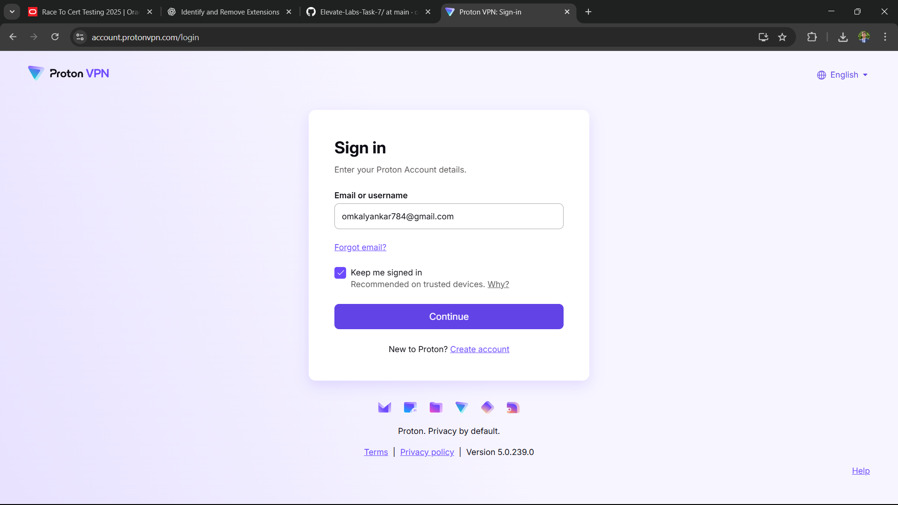
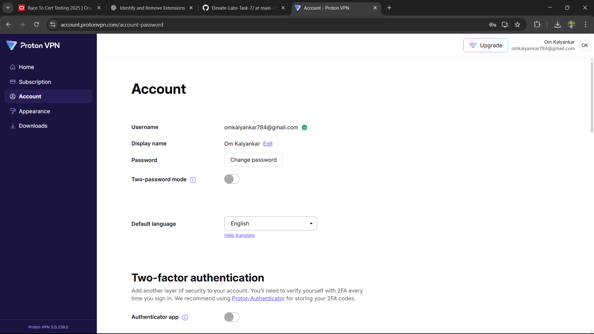
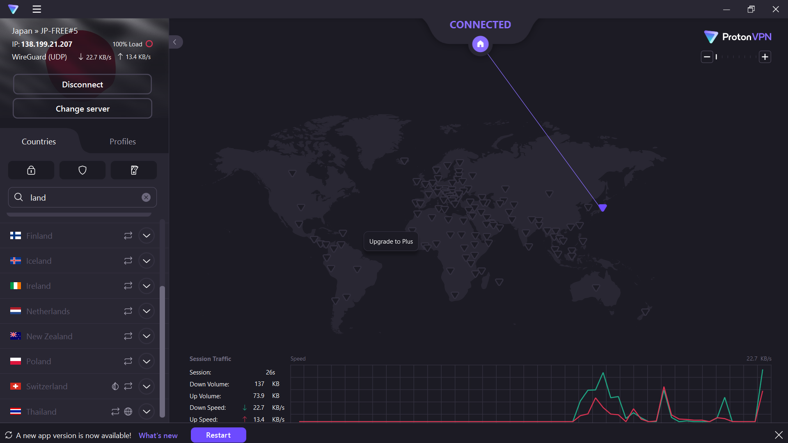
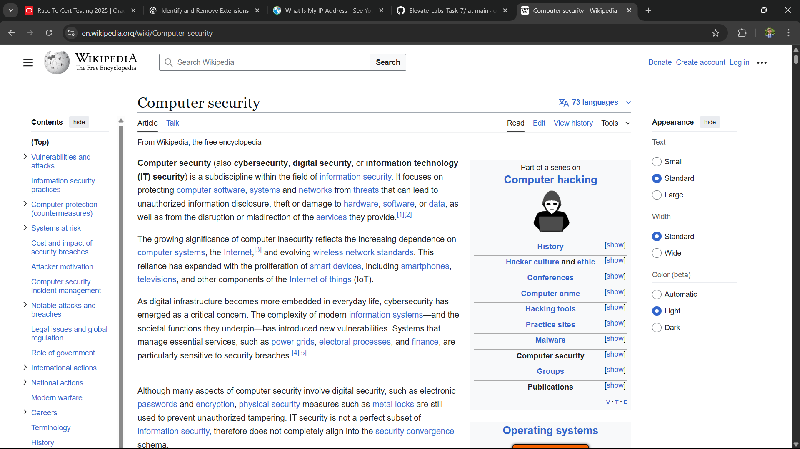

# 🔐 Task 8: VPN Setup and Privacy Protection

## 🎯 Objective
Understand the role of VPNs in protecting privacy and secure communication.

---

## 🛠 Steps Taken
- ✅ **Chose VPN Provider**  
  → Selected **ProtonVPN Free** for its reliability and no-logs policy.  
- 📥 **Downloaded & Installed VPN Client**  
  → Downloaded official client from [protonvpn.com](https://protonvpn.com/).  
- 🔑 **Signed In**  
  → Created a free account and logged in to the VPN app.  
- 🌍 **Connected to VPN Server**  
  → Chose a server located in **Netherlands** for optimal speed & privacy.  
- 🕵️ **Verified IP Address Change**  
  → Checked on [whatismyipaddress.com](https://whatismyipaddress.com/) — IP was different from my actual one.  
- 🔒 **Tested Encrypted Browsing**  
  → Visited websites; data was tunneled through the VPN securely.  
- ⏹ **Disconnected & Compared Speeds**  
  → Slight speed drop, but secure browsing benefits outweigh performance loss.

---

## 📸 Screenshots

**1️⃣ VPN Client Installation**  

**2️⃣ Logging into VPN**  

**3️⃣ Connected to Server**  

**4️⃣ IP Address Change Verification**  

**5️⃣ Browsing with VPN On**  

---

## 📚 Research: VPN Encryption & Privacy
- **Encryption** → VPN encrypts all internet traffic using protocols like OpenVPN, WireGuard, or IKEv2, making it unreadable to ISPs or hackers.
- **Privacy** → Hides your real IP, masking your location and identity.
- **Tunneling Protocols** → Securely route traffic between your device and VPN server.
- **Protection Against Tracking** → Prevents websites and advertisers from building a tracking profile.

---

## ✅ Benefits
- 🛡️ Enhanced privacy & anonymity online.  
- 🔒 Encrypted traffic for secure browsing on public Wi-Fi.  
- 🌍 Ability to bypass geo-restrictions.  

## ⚠️ Limitations
- 📉 Reduced internet speed.  
- 🚫 Free VPNs may have bandwidth/server limitations.  
- 🔍 Some services may block VPN traffic.

---

## 📌 Outcome
Hands-on experience in:
- Installing and configuring a VPN.
- Verifying IP changes.
- Understanding VPN encryption, tunneling, and privacy features.
